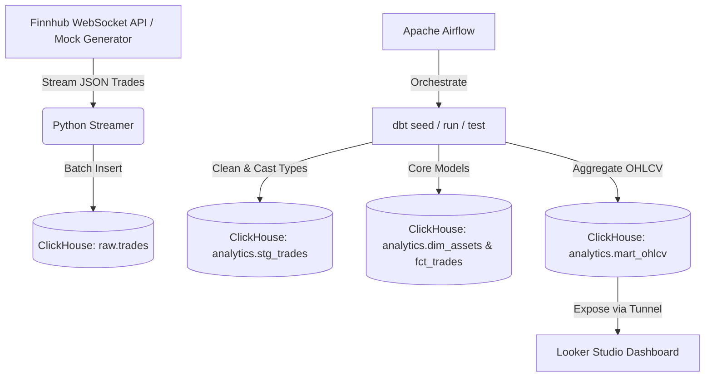

<div align="right">
  🌐 <strong><a href="README.md">🇬🇧 English</a></strong> | <strong><a href="README_th.md">🇹🇭 ภาษาไทย</a></strong>
</div>

# FinnHub Streaming Data Pipeline

An end-to-end real-time data engineering pipeline that streams financial market trade events (stocks and cryptocurrencies) from the **Finnhub WebSocket API** (or simulates them in Mock Mode), stores them in **ClickHouse**, performs batch transformations using **dbt**, schedules models via **Apache Airflow**, and visualizes trading metrics in **Looker Studio (Google Data Studio)**.

## Architecture



## Features
- **Decoupled Architecture**: Strictly separates the ingestion engine (standalone Python daemon) from transformations (dbt scheduled by Airflow) to prevent pipeline lockups and ClickHouse performance drops.
- **Dual Ingestion Mode**: Stream real-time data using a Finnhub API key or automatically fallback to a robust **Mock Trade Generator** if no key is provided.
- **Star Schema Modeling**: Implements a professional dimensional modeling design with fact (`fct_trades`) and dimension (`dim_assets`) tables.
- **Incremental Processing**: Configured dbt incremental loads for high-frequency transactional data to minimize compute resource usage.
- **ClickHouse Optimization**: Uses buffered batch inserts to maximize ClickHouse write performance and utilizes native ClickHouse functions like `argMin`/`argMax` for fast aggregates.
- **Fully Containerized**: PostgreSQL (Airflow backend), ClickHouse, Airflow Scheduler/Webserver, and the Python Streamer run in Docker Compose.

---

## Getting Started

### 1. Prerequisites
- Docker & Docker Compose installed.
- (Optional) A free API key from [Finnhub.io](https://finnhub.io/).
- (Optional) [ngrok](https://ngrok.com/) installed on your host machine to connect Looker Studio to your local ClickHouse.

### 2. Running the Pipeline
Clone the repository and run:

```bash
docker-compose up --build -d
```

If you have a Finnhub API Key, create a `.env` file in the root directory first:
```env
FINNHUB_API_KEY=your_api_key_here
```

### 3. Verify Container Status
Check that all containers are healthy:
```bash
docker-compose ps
```

Access the Airflow UI:
- **URL**: `http://localhost:8080`
- **Username**: `admin`
- **Password**: `admin`

Trigger the `finnhub_dbt_run` DAG to execute transformations.

---

## Querying the Data in ClickHouse

To verify raw trade events are streaming into ClickHouse:
```bash
docker exec -it sharp-maxwell-clickhouse-1 clickhouse-client --query "SELECT * FROM raw.trades LIMIT 10"
```

To check the transformed minutely OHLCV data:
```bash
docker exec -it sharp-maxwell-clickhouse-1 clickhouse-client --query "SELECT * FROM analytics.mart_ohlcv LIMIT 10"
```

---

## Architectural Design: Separation of Components

This pipeline employs a highly decoupled architecture following production-grade best practices, specifically addressing potential anti-patterns in data pipeline design:

### 1. Decoupled Ingestion vs. Transformation
- **The Ingestion Layer** runs continuously as a standalone Python daemon (`streamer` service). It reads from the WebSocket API, buffers incoming ticks in memory, and writes micro-batches to ClickHouse raw storage. 
- **The Transformation Layer** runs as a batch dbt project.
- **Why separate them?** Chaining ingestion and dbt run sequentially in the same Airflow DAG (e.g. running dbt every time a chunk of data is ingested) is an anti-pattern. If ingestion runs frequently (e.g. streaming or every few minutes), triggering dbt run on every write creates massive, redundant database load and will exhaust scheduler resources. By separating them, we allow ClickHouse to ingest raw trades continuously in real-time, while Airflow triggers dbt on an hourly or daily schedule to build analytical tables asynchronously.

### 2. Streaming Outside Airflow
- **Why not run ingestion inside Airflow?** Running a long-running WebSocket subscription or streaming daemon inside an Airflow worker task (e.g., using PythonOperator) is an anti-pattern and overkill. Airflow is designed to coordinate short-lived, stateless, batch task processes. Running a continuous streaming job inside Airflow locks up workers, violates task isolation, makes scheduler health checks fragile, and leads to unstable execution. Instead, the streamer runs as a dedicated, lightweight Docker container, completely external to Airflow.

### 3. Component Details & Objectives
To clarify the purpose of each service in the stack, we define their objectives below:
- **Ingestion Daemon (`streamer` service)**: Pulls high-frequency trading data at millisecond levels, buffers events in-memory, and commits them to ClickHouse in micro-batches to optimize network and I/O efficiency.
- **Data Warehouse (`clickhouse-server`)**: Stores massive transactional events in a column-oriented storage format using the `MergeTree` engine, allowing microsecond analytical aggregations.
- **Transformation Tool (`dbt`)**: Responsible for cleansing raw logs, structuring them into a Star Schema (Core dimensional models), and building marts. All queries run in-database (ELT).
- **Workflow Orchestrator (`airflow`)**: Manages the schedule for triggering dbt transformations and executes automated data quality checks, eliminating redundant computations.
- **BI Interface (`Looker Studio`)**: Exposes an interactive financial advisor panel where investors can query calculations dynamically using input budget and profit targets.

### 4. Design Principles
Our architectural design relies on three core tenets:
1. **Separation of Concerns (SoC)**: Keeps long-running streaming services separate from batch processing. A failure in the streaming container does not impact task coordination inside Airflow.
2. **ELT (Extract, Load, Transform)**: Data is written directly to the database as-is without inline processing to prevent data loss. Transformations are deferred to dbt inside ClickHouse.
3. **Dimensional Modeling (Star Schema)**: Transforms flat OBT datasets into structured dimensions (`dim_assets`) and transactional facts (`fct_trades`) to ensure model durability, logical relationships, and multiple perspectives.

### 5. Definitions of Ambiguous Terms
To reduce business logic ambiguity, we define key terms used in our pipeline:
1. **"Price Diversity / Volatility"**: 
   - *Technical Definition*: Calculated using **Price Spread** ($=$ High price $-$ Low price inside a 1-minute window) and **Relative Volatility Spread** ($=$ Price Spread $/$ Open Price).
   - *Business Interpretation*: Higher spreads represent diverse bid/ask valuations, indicating trading volatility suitable for short-term gains.
2. **"Estimated 3-Month Gain"**:
   - *Technical Definition*: Defined as a conservative estimate calculated as **25% of the 1-year analyst consensus target price growth** (`target_median` relative to `current_price`).
   - *Business Interpretation*: A normalized near-term benchmark for forecasting returns.
3. **"Consensus Rating"**:
   - *Technical Definition*: Calculated based on analyst buy/sell ratios:
     - **Strong Buy**: If Buy + Strong Buy ratings $> 70\%$ of total analyst ratings.
     - **Buy**: If Buy + Strong Buy ratings are between $50\% - 70\%$.
     - **Sell**: If Sell + Strong Sell ratings $> 30\%$.
     - **Hold**: All other distributions.

---

## Business Questions & Dashboard Metrics Mapping

To ensure the Looker Studio dashboard directly answers key business questions, our dbt mart models and visualizations are explicitly mapped as follows:

| Business Question | Dashboard Metric / Chart | SQL Implementation Details |
| :--- | :--- | :--- |
| **1. What is the total volume and transaction count of each asset?** | **Total Volume** & **Trade Count** KPI cards and bar charts. | Sums volume (`sum(volume)`) and counts transactions (`count()`) within each minute window. |
| **2. What is the price movement trend and rate?** | **OHLCV Candlestick Chart** & **Average Price Line Chart**. | Computes opening, highest, lowest, and closing prices for each minute window. |
| **3. How volatile/diverse is the trading behavior?** | **Price Spread** & **Relative Spread** Trend Charts. | Computes the absolute spread (`high - low`) and the relative spread (`spread / open`) for each window. This gauges the variance and diversity of market price fluctuations. |

---

## Connecting Looker Studio

Since Looker Studio is a cloud service, you can expose your local ClickHouse server HTTP port (`8123`) using **ngrok**:

1. Run ngrok on your host:
   ```bash
   ngrok http 8123
   ```
2. Copy the public forwarding URL (e.g., `https://xxxx-xx-xx.ngrok-free.app`).
3. Open [Looker Studio](https://lookerstudio.google.com/), click **Create Data Source**, and search for the **ClickHouse Connector** by ClickHouse.
4. Configure the connection using the ngrok URL:
   - **Host**: `xxxx-xx-xx.ngrok-free.app` (exclude the `https://`)
   - **Port**: `443` (since ngrok uses HTTPS)
   - **User**: `default`
   - **Password**: (leave blank)
   - **Database**: `analytics`
   - **Table**: `mart_ohlcv` or `mart_investment_advisor`

### Dashboard Visualization
Here is a preview of the Looker Studio Dashboard showing stock price trends, trading volumes, and transaction counts:


---

## Smart Investment Advisor (Interactive Dashboard Integration)

To address users who **"cannot analyze technical charts easily"** and want immediate answers directly on the dashboard without asking a bot: **"If I have this much budget and want x% profit in 3 months, which asset should I buy the most?"**

We created the **`mart_investment_advisor`** table. Integrated with Looker Studio's **Input Parameter** features, the dashboard calculates investment choices dynamically:

### 1. Data Fields Prepared by dbt:
- `current_price`: Latest raw trade price.
- `target_median`: Median 1-year target price by Wall Street analysts.
- `upside_potential_percent`: Potential price growth (%) over 1 year.
- `estimated_gain_3m_percent`: Estimated return rate (%) in 3 months (calculated as 25% of the 1-year upside).
- `consensus_rating`: General analyst consensus (e.g., *Strong Buy*, *Buy*, *Hold*, *Sell*).

### 2. Interactive Features on Looker Studio:
1. **Enter Budget & Target Profit %**: The user enters their budget (e.g., `$10,000`) and target return (e.g., `10%`) via dashboard input fields.
2. **Automated Calculated Fields**:
   - **Shares to Buy**: `Budget / current_price`
   - **Expected 3-Month Profit ($)**: `Budget * (estimated_gain_3m_percent / 100)`
   - **Meets Target?**: `IF(estimated_gain_3m_percent >= Target_Profit, '✅ Pass', '❌ Fail')`
3. **Recommendation Ranking**: The table ranks assets by `estimated_gain_3m_percent` descending, showing the user exactly which asset best hits their financial target.

---

## Homework Answers

### 1. What did you learn from this project?
- **Real-Time Data Streaming & Ingestion**: Learned how to implement a WebSocket client in Python that maintains a persistent connection, handles reconnections, buffers streaming trade data, and loads it to ClickHouse in micro-batches to prevent high IO overhead.
- **ClickHouse Performance**: Realized ClickHouse's power for analytical processing. Instead of performing slow joins and row-by-row updates, I used ClickHouse's native `argMin` and `argMax` functions to calculate `Open` and `Close` prices in `GROUP BY` aggregates in seconds.
- **dbt ClickHouse Adapter**: Gained experience utilizing the `dbt-clickhouse` adapter, managing staging views and table-materialized marts, and using Airflow to orchestrate the pipeline stages automatically.

### 2. How would you improve it?
- **Decouple with Message Broker (Kafka)**: In production, direct writes from a WebSocket client to ClickHouse are risky (e.g. if ClickHouse is temporarily unavailable). Introducing a message broker like Apache Kafka or Redpanda would queue raw events, add durability, and allow other microservices to consume the data.
- **dbt Incremental Models**: Instead of doing full table refreshes (`+materialized: table`), transform the dbt models into `incremental` tables using the `insert_overwrite` or `append` strategies to only process new trades since the last run.
- **Schema Validation & Registry**: Use a Schema Registry (like Confluent's) and enforce schemas (e.g. Avro or Protobuf) to handle API contract changes gracefully.

### 3. If you have to do it all over again, what would you do differently?
- **Use ClickHouse Materialized Views**: Instead of scheduling batch dbt models on a schedule via Airflow, I would define ClickHouse **Materialized Views** directly on the raw tables. ClickHouse Materialized Views compute aggregations (like OHLCV) *on insert*, turning this into a true real-time, zero-batch-overhead pipeline.
- **Use an Ingestion Agent**: Instead of writing a custom Python daemon, I would consider using lightweight agents like **Vector** or **Benthos** to read from the WebSocket and write directly to ClickHouse, reducing the amount of custom code to maintain.
