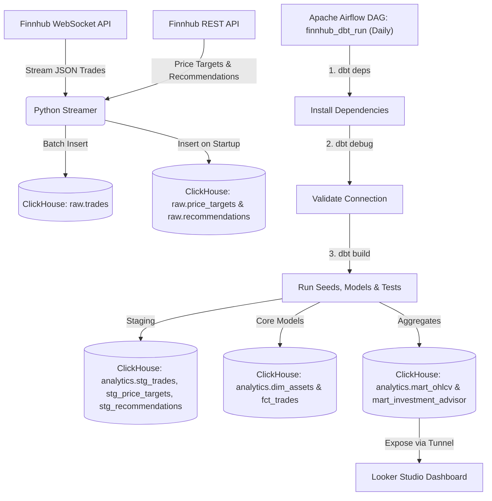

# FinnHub Streaming Data Pipeline

An end-to-end real-time data engineering pipeline that streams financial market trade events (stocks and cryptocurrencies) from the **Finnhub WebSocket API**, stores them in **ClickHouse**, performs batch transformations using **dbt**, schedules models via **Apache Airflow**, and visualizes trading metrics in **Looker Studio (Google Data Studio)**.

## Architecture



## Features
- **Decoupled Architecture**: Strictly separates the ingestion engine (standalone Python daemon) from transformations (dbt scheduled by Airflow) to prevent pipeline lockups and ClickHouse performance drops.
- **Real-Time Market Ingestion**: Streams live stock and cryptocurrency trades directly from Finnhub WebSocket and ingests analyst recommendations & price targets via Finnhub REST API.
- **Analyst Data Ingestion**: On startup, the streamer fetches analyst **price targets** and **recommendations** from the Finnhub REST API and stores them in `raw.price_targets` and `raw.recommendations`.
- **Star Schema Modeling**: Implements a professional dimensional modeling design with fact (`fct_trades`) and dimension (`dim_assets`) tables, plus dedicated mart tables (`mart_ohlcv`, `mart_investment_advisor`).
- **Source UUID Generator**: Generates `trade_id` as UUIDv4 at the streamer ingestion source to guarantee transaction uniqueness and completely prevent key collision risk in high-frequency trading ticks.
- **Configurable Batching**: Tune write behavior via environment variables — `BATCH_SIZE` (default: 100 records) and `BATCH_INTERVAL_SEC` (default: 2.0 s) — to balance throughput and latency.
- **ClickHouse Optimization**: Uses buffered batch inserts to maximize ClickHouse write performance and utilizes native ClickHouse functions like `argMin`/`argMax` for fast aggregates.
- **3-Step Airflow DAG (`finnhub_dbt_run`)**: Runs daily on a structured task chain — `dbt deps` → `dbt debug` → `dbt build` — to install packages, validate the connection, then run seeds, models, and tests in dependency order.
- **CI/CD Quality Control & Testing**: Implemented a GitHub Actions CI workflow to automatically run formatting checks (`black`), Python syntax analysis (`flake8`), and automated unit tests (`pytest`) on pull requests or commits.
- **Fully Containerized**: PostgreSQL (Airflow backend), ClickHouse, Airflow Scheduler/Webserver, and the Python Streamer all run in a single `docker-compose up` command.

---

## Getting Started

### 1. Prerequisites
- Docker & Docker Compose installed.
- An API key from [Finnhub.io](https://finnhub.io/).
- (Optional) SSH client (pre-installed on macOS/Linux) to create a [Pinggy](https://pinggy.io/) tunnel for Looker Studio connectivity.

### 2. Running the Pipeline
Clone the repository, create a `.env` file in the root directory:
```env
FINNHUB_API_KEY=your_api_key_here
```

Then run:
```bash
docker-compose up --build -d
```

#### Environment Variables

| Variable | Default | Description |
|---|---|---|
| `FINNHUB_API_KEY` | _(required)_ | Finnhub API key. |
| `SYMBOLS` | `AAPL,MSFT,TSLA,BINANCE:BTCUSDT,BINANCE:ETHUSDT` | Comma-separated list of symbols to track. |
| `BATCH_SIZE` | `100` | Flush buffer to ClickHouse after this many records. |
| `BATCH_INTERVAL_SEC` | `2.0` | Flush buffer if this many seconds have elapsed (whichever comes first). |

### 3. Verify Container Status
Check that all containers are healthy:
```bash
docker-compose ps
```

Access the Airflow UI:
- **URL**: `http://localhost:8080`
- **Username**: `admin`
- **Password**: `admin`

Trigger the `finnhub_dbt_run` DAG to execute transformations.

---

## Querying the Data in ClickHouse

To verify raw trade events are streaming into ClickHouse:
```bash
docker exec -it sharp-maxwell-clickhouse-1 clickhouse-client --query "SELECT * FROM raw.trades LIMIT 10"
```

To verify analyst data was ingested at startup:
```bash
docker exec -it sharp-maxwell-clickhouse-1 clickhouse-client --query "SELECT * FROM raw.price_targets LIMIT 10"
docker exec -it sharp-maxwell-clickhouse-1 clickhouse-client --query "SELECT * FROM raw.recommendations LIMIT 10"
```

To check the transformed hourly OHLCV data:
```bash
docker exec -it sharp-maxwell-clickhouse-1 clickhouse-client --query "SELECT * FROM analytics.mart_ohlcv LIMIT 10"
```

To check the Smart Investment Advisor mart:
```bash
docker exec -it sharp-maxwell-clickhouse-1 clickhouse-client --query "SELECT symbol, current_price, upside_potential_percent, estimated_gain_3m_percent, consensus_rating FROM analytics.mart_investment_advisor"
```

---

## Architectural Design: Separation of Components

This pipeline employs a highly decoupled architecture following production-grade best practices, specifically addressing potential anti-patterns in data pipeline design:

### 1. Decoupled Ingestion vs. Transformation
- **The Ingestion Layer** runs continuously as a standalone Python daemon (`streamer` service). On startup it fetches analyst price targets and recommendations (via Finnhub REST API) and writes them to ClickHouse. It then reads trade ticks from the WebSocket, buffers them in memory, and flushes micro-batches to ClickHouse raw storage.
- **The Transformation Layer** runs as a batch dbt project triggered daily by Airflow.
- **Why separate them?** Chaining ingestion and dbt run sequentially in the same Airflow DAG is an anti-pattern. If ingestion runs frequently (e.g. streaming or every few minutes), triggering dbt run on every write creates massive, redundant database load and will exhaust scheduler resources. By separating them, we allow ClickHouse to ingest raw trades continuously in real-time, while Airflow triggers dbt on a daily schedule to build analytical tables asynchronously.

### 2. Streaming Outside Airflow
- **Why not run ingestion inside Airflow?** Running a long-running WebSocket subscription or streaming daemon inside an Airflow worker task (e.g., using PythonOperator) is an anti-pattern and overkill. Airflow is designed to coordinate short-lived, stateless, batch task processes. Running a continuous streaming job inside Airflow locks up workers, violates task isolation, makes scheduler health checks fragile, and leads to unstable execution. Instead, the streamer runs as a dedicated, lightweight Docker container, completely external to Airflow.

### 3. Component Details & Objectives
To clarify the purpose of each service in the stack, we define their objectives below:
- **Ingestion Daemon (`streamer` service)**: On startup, fetches analyst data (price targets + recommendations) via Finnhub REST API. Then continuously pulls high-frequency trading data at millisecond resolution, buffers events in-memory, and commits them to ClickHouse in micro-batches to optimize network and I/O efficiency.
- **Data Warehouse (`clickhouse-server`)**: Stores raw events across three tables (`raw.trades`, `raw.price_targets`, `raw.recommendations`) in a column-oriented format using the `MergeTree` engine, allowing microsecond analytical aggregations.
- **Transformation Tool (`dbt`)**: Responsible for cleansing raw logs, structuring them into a Star Schema (core dimensional models), and building analytical marts (`mart_ohlcv`, `mart_investment_advisor`). All queries run in-database (ELT).
- **Workflow Orchestrator (`airflow`)**: Runs the `finnhub_dbt_run` DAG daily with three ordered tasks: `dbt deps` → `dbt debug` → `dbt build`. Executes automated data quality checks via dbt tests, eliminating redundant computations.
- **BI Interface (`Looker Studio`)**: Exposes an interactive financial advisor panel where investors can query calculations dynamically using input budget and profit targets.

### 4. Design Principles
Our architectural design relies on three core tenets:
1. **Separation of Concerns (SoC)**: Keeps long-running streaming services separate from batch processing. A failure in the streaming container does not impact task coordination inside Airflow.
2. **ELT (Extract, Load, Transform)**: Data is written directly to the database as-is without inline processing to prevent data loss. Transformations are deferred to dbt inside ClickHouse.
3. **Dimensional Modeling (Star Schema)**: Transforms flat OBT datasets into structured dimensions (`dim_assets`) and transactional facts (`fct_trades`) to ensure model durability, logical relationships, and multiple perspectives.

### 5. Definitions of Ambiguous Terms
To reduce business logic ambiguity, we define key terms used in our pipeline:
1. **"Price Diversity / Volatility"**: 
   - *Technical Definition*: Calculated using **Price Spread** ($=$ High price $-$ Low price inside a 1-hour window) and **Relative Volatility Spread** ($=$ Price Spread $/$ Open Price).
   - *Business Interpretation*: Higher spreads represent diverse bid/ask valuations, indicating trading volatility suitable for short-term gains.
2. **"Estimated 3-Month Gain"**:
   - *Technical Definition*: Defined as a conservative estimate calculated as **25% of the 1-year analyst consensus target price growth** (`target_median` relative to `current_price`).
   - *Business Interpretation*: A normalized near-term benchmark for forecasting returns.
3. **"Consensus Rating"**:
   - *Technical Definition*: Calculated based on analyst buy/sell ratios:
     - **Strong Buy**: If Buy + Strong Buy ratings $> 70\%$ of total analyst ratings.
     - **Buy**: If Buy + Strong Buy ratings are between $50\% - 70\%$.
     - **Sell**: If Sell + Strong Sell ratings $> 30\%$.
     - **Hold**: All other distributions.

---

## Business Questions & Dashboard Metrics Mapping

To ensure the Looker Studio dashboard directly answers key business questions, our dbt mart models and visualizations are explicitly mapped as follows:

| Business Question | Dashboard Metric / Chart | SQL Implementation Details |
| :--- | :--- | :--- |
| **1. What is the total volume and transaction count of each asset?** | **Total Volume** & **Trade Count** KPI cards and bar charts. | Sums volume (`sum(volume)`) and counts transactions (`count()`) within each hourly window. |
| **2. What is the price movement trend and rate?** | **OHLCV Candlestick Chart** & **Average Price Line Chart**. | Computes opening, highest, lowest, and closing prices for each hourly window. |
| **3. How volatile/diverse is the trading behavior?** | **Price Spread** & **Relative Spread** Trend Charts. | Computes the absolute spread (`high - low`) and the relative spread (`spread / open`) for each window. This gauges the variance and diversity of market price fluctuations. |

---

## Connecting Looker Studio

Since Looker Studio is a cloud service, you need to expose your local ClickHouse to the internet. This project uses **Pinggy** — a free SSH-based tunnel that works without installing any extra tools.

> [!NOTE]
> Pinggy's free tier tunnels are limited to **1 hour** per session. Re-run the command to get a new tunnel URL when it expires.

### 1. Open the Pinggy Tunnel

Run this command on your **host machine** (not inside Docker):

```bash
ssh -o ServerAliveInterval=30 -o ServerAliveCountMax=3 -p 443 -R 0:localhost:9004 tcp@a.pinggy.io
```

This exposes ClickHouse's **MySQL-wire protocol port** (`9004`) through a public TCP endpoint. After connecting, Pinggy will print your public address, for example:

```
tcp://txxxxxxxxxxxx.a.pinggy.io:XXXXX
```

### 2. Configure the ClickHouse Connector in Looker Studio

1. Open [Looker Studio](https://lookerstudio.google.com/), click **Create** → **Data Source**.
2. Search for the **ClickHouse** connector (by ClickHouse, Inc.).
3. Fill in the connection settings using the Pinggy address printed above:

| Field | Value |
|---|---|
| **Host** | `txxxxxxxxxxxx.a.pinggy.io` (hostname only, no `tcp://`) |
| **Port** | `XXXXX` (the port printed by Pinggy) |
| **Protocol** | `MySQL` (uses port 9004) |
| **User** | `default` |
| **Password** | _(leave blank)_ |
| **Database** | `analytics` |

4. Click **Authenticate**, then select the table you need:
   - `mart_ohlcv` — for OHLCV candlestick / price trend charts
   - `mart_investment_advisor` — for the Smart Investment Advisor panel

### Dashboard Visualization
Here is a preview of the Looker Studio Dashboard showing stock price trends, trading volumes, and transaction counts:


---

## Smart Investment Advisor (Interactive Dashboard Integration)

To address users who **"cannot analyze technical charts easily"** and want immediate answers directly on the dashboard without asking a bot: **"If I have this much budget and want x% profit in 3 months, which asset should I buy the most?"**

We created the **`mart_investment_advisor`** table. Integrated with Looker Studio's **Input Parameter** features, the dashboard calculates investment choices dynamically:

### 1. Data Fields Prepared by dbt:
- `current_price`: Latest raw trade price.
- `target_median`: Median 1-year target price by Wall Street analysts.
- `upside_potential_percent`: Potential price growth (%) over 1 year.
- `estimated_gain_3m_percent`: Estimated return rate (%) in 3 months (calculated as 25% of the 1-year upside).
- `consensus_rating`: General analyst consensus (e.g., *Strong Buy*, *Buy*, *Hold*, *Sell*).

### 2. Interactive Features on Looker Studio:
1. **Enter Budget & Target Profit %**: The user enters their budget (e.g., `$10,000`) and target return (e.g., `10%`) via dashboard input fields.
2. **Automated Calculated Fields**:
   - **Shares to Buy**: `Budget / current_price`
   - **Expected 3-Month Profit ($)**: `Budget * (estimated_gain_3m_percent / 100)`
   - **Meets Target?**: `IF(estimated_gain_3m_percent >= Target_Profit, '✅ Pass', '❌ Fail')`
3. **Recommendation Ranking**: The table ranks assets by `estimated_gain_3m_percent` descending, showing the user exactly which asset best hits their financial target.

---

## Homework Answers

### 1. What did you learn from this project?

เดิมทีคิดว่าดึงข้อมูลจาก API แล้วเซฟลงฐานข้อมูลมันน่าจะไม่มีอะไร แต่พอไปถึงขั้นแสดงผลแดชบอร์ด เหมือนมันจะเส้นเยอะไปจนแสดงกราฟไม่ได้ ก็ต้องเลือกบางช่วงมาใส่เอา การปรับข้อมูลให้แสดงผลในแดชบอร์ดให้ดูรู้เรื่องเป็นสิ่งที่คิดว่าได้เรียนรู้มากที่สุด นอกจากนี้ก็มีเรื่องการยิงที่ ต้องกองข้อมูลไว้ก่อนแล้วค่อยยิงเป็นกลุ่มเพื่อไม่ให้ฐานข้อมูลรับไม่ไหว
และที่สำคัญที่สุดคือเรื่องการแยก service ถ้าให้ Airflow ดูแลทั้งการดึงข้อมูลและ transform พร้อมกัน มันจะพัง แต่พอแยก streamer ออกมาเป็น container ของตัวเอง ทุกอย่างก็จะเสถียรขึ้นมากค่ะ

---

### 2. How would you improve it?

อย่างแรกที่อยากทำคือเพิ่ม message queue กลางๆ อย่าง Kafka ไว้คั่นระหว่าง streamer กับ ClickHouse เพราะตอนนี้ถ้า ClickHouse ล่ม ข้อมูลที่วิ่งเข้ามาตอนนั้นก็จะหายเลย ถ้ามี queue มารับไว้ก่อนก็จะปลอดภัยกว่า
อีกอย่างคือ dbt ตอนนี้ทำ full refresh ทุกครั้ง อยากเปลี่ยนให้มันประมวลเฉพาะข้อมูลใหม่ที่เพิ่งเข้ามาตั้งแต่ครั้งล่าสุด

---

### 3. If you have to do it all over again, what would you do differently?

อยากลองใช้เครื่องมือสำเร็จรูปอย่าง Vector แทนการเขียน Python streamer เอง เพราะโค้ดที่เขียนเองยิ่งเพิ่ม feature ยิ่งต้องดูแลเยอะขึ้น ถ้ามีเครื่องมือที่ทำเรื่องนี้อยู่แล้วก็น่าจะใช้มันดีกว่า
