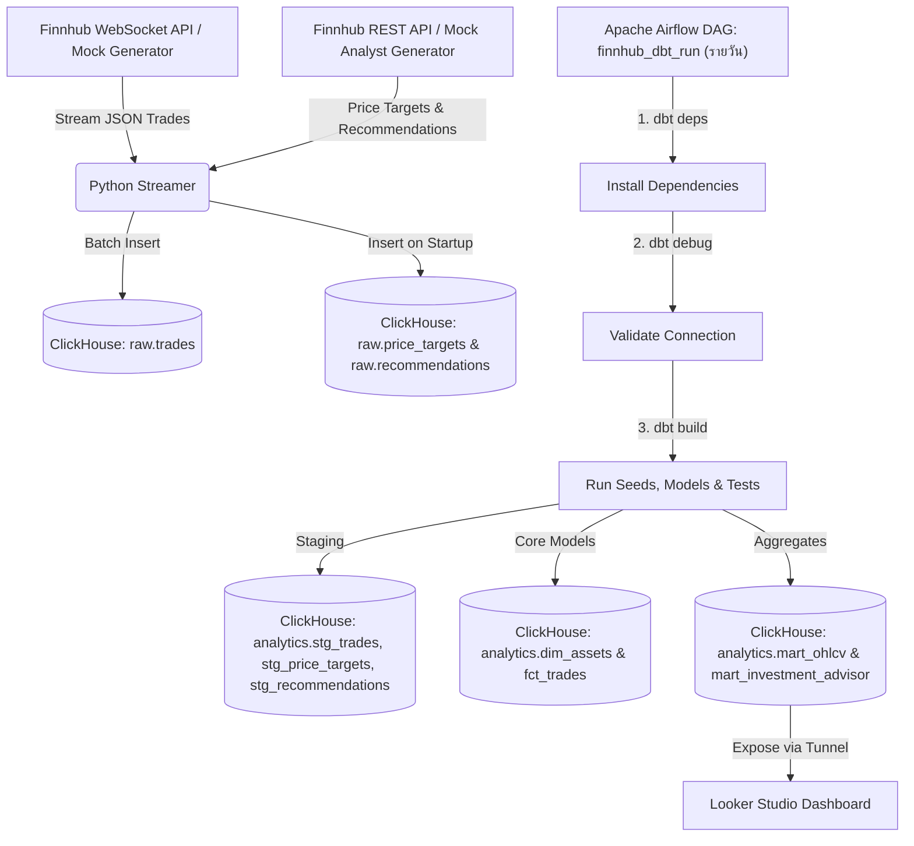
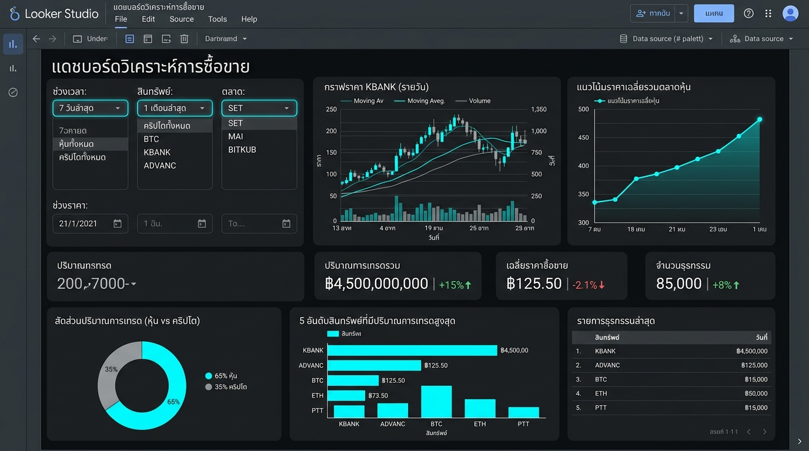

# FinnHub Streaming Data Pipeline (ภาษาไทย)

โปรเจกต์ Data Engineering ท่อส่งข้อมูลธุรกรรมทางการเงิน (หุ้นและคริปโทฯ) จาก **Finnhub WebSocket API** (หรือจำลองข้อมูลด้วย Mock Mode) ส่งเข้าสู่ **ClickHouse**, ทำการแปลงข้อมูล (Transform) ด้วย **dbt**, กำหนดรอบทำงาน (Orchestrate) ด้วย **Apache Airflow** และวิเคราะห์ผลบน **Looker Studio (Google Data Studio)**

---

## สถาปัตยกรรมระบบ (Architecture)



## ฟีเจอร์หลัก (Features)
- **สถาปัตยกรรมแบบ Decoupled (แยกส่วนอิสระ)**: ตัวดึงข้อมูล (Ingestion) และตัวแปลงข้อมูล (dbt) ทำงานแยกจากกันเพื่อความเสถียรและประสิทธิภาพสูงสุด
- **Dual Ingestion Mode**: ดึงข้อมูลตลาดจริงผ่าน Finnhub API Key หรือให้ระบบ fallback ไปรัน **Mock Trade Generator** (จำลองราคาแบบ random walk) อัตโนมัติเมื่อไม่มี key
- **Analyst Data Ingestion**: เมื่อ streamer เริ่มทำงาน จะดึงข้อมูล **ราคาเป้าหมาย** และ **คำแนะนำจากนักวิเคราะห์** จาก Finnhub REST API (หรือ generate mock ใน Mock Mode) แล้วบันทึกลงใน `raw.price_targets` และ `raw.recommendations`
- **Star Schema Design**: จัดโครงสร้างตารางในระดับ Core Layer เป็นตารางมิติ (`dim_assets`) และตารางข้อเท็จจริง (`fct_trades`) พร้อม mart tables ครบ 2 ตัว (`mart_ohlcv`, `mart_investment_advisor`)
- **Source UUID Generator**: สร้างคีย์ธุรกรรม (`trade_id`) ด้วย UUIDv4 ตั้งแต่ตอนดึงข้อมูล (Ingestion) เพื่อรับประกันความไม่ซ้ำกันของธุรกรรมระดับมิลลิวินาที
- **Configurable Batching**: ปรับพฤติกรรมการเขียนข้อมูลได้ผ่าน environment variables — `BATCH_SIZE` (default: 100 records) และ `BATCH_INTERVAL_SEC` (default: 2.0 วินาที)
- **ClickHouse Optimization**: ใช้การเขียนแบบ micro-batches และฟังก์ชันเฉพาะของ ClickHouse เช่น `argMin`/`argMax` เพื่อคำนวณราคาเปิด/ปิดอย่างมีประสิทธิภาพ
- **3-Step Airflow DAG (`finnhub_dbt_run`)**: รันทุกวัน ตาม task chain — `dbt deps` → `dbt debug` → `dbt build` — ติดตั้ง packages, ตรวจสอบ connection, แล้วรัน seeds/models/tests ตามลำดับ dependency
- **CI Pipeline**: GitHub Actions CI Workflow ตรวจ formatting (`black`) และ syntax (`flake8`) อัตโนมัติทุกครั้งที่ push หรือ pull request
- **Fully Containerized**: PostgreSQL, ClickHouse, Airflow และ Streamer รันพร้อมกันหมดด้วยคำสั่งเดียว `docker-compose up`


---

## ขั้นตอนการติดตั้งและรันระบบ

### 1. สิ่งที่ต้องมีก่อนติดตั้ง (Prerequisites)
- ติดตั้ง **Docker & Docker Compose**
- (ตัวเลือกเพิ่มเติม) สมัครขอ API key ฟรีจาก [Finnhub.io](https://finnhub.io/)
- (ตัวเลือกเพิ่มเติม) SSH client (มีอยู่แล้วใน macOS/Linux) สำหรับเปิด tunnel ผ่าน [Pinggy](https://pinggy.io/) เพื่อเชื่อมต่อกับ Looker Studio

### 2. การสั่งเริ่มทำงาน
จากไดเรกทอรีหลักของโปรเจกต์ สั่งรันด้วยคำสั่ง:

```bash
docker-compose up --build -d
```

หากต้องการใช้ข้อมูลจริง ให้สร้างไฟล์ `.env` ที่โฟลเดอร์หลักก่อนสั่งรัน:
```env
FINNHUB_API_KEY=รหัส_api_key_ของคุณ
```

หากไม่ใส่ key ระบบจะรัน **Mock Mode** อัตโนมัติ — สร้างข้อมูลซื้อขายจำลองและข้อมูลนักวิเคราะห์ mock โดยไม่ต้องพึ่งภายนอก

#### Environment Variables ที่ปรับได้

| ตัวแปร | ค่าเริ่มต้น | คำอธิบาย |
|---|---|---|
| `FINNHUB_API_KEY` | _(ว่าง)_ | Finnhub API key — ถ้าว่างจะ fallback เป็น Mock Mode |
| `SYMBOLS` | `AAPL,MSFT,TSLA,BINANCE:BTCUSDT,BINANCE:ETHUSDT` | รายชื่อสินทรัพย์ที่ต้องการติดตาม คั่นด้วย `,` |
| `BATCH_SIZE` | `100` | จำนวน records ที่กองไว้ก่อน flush ลง ClickHouse |
| `BATCH_INTERVAL_SEC` | `2.0` | เวลาสูงสุด (วินาที) ก่อน flush แม้ยังไม่ถึง BATCH_SIZE |

### 3. ตรวจสอบสถานะการทำงาน
ดูความสมบูรณ์ของ Containers:
```bash
docker-compose ps
```

เข้าสู่ระบบจัดการ workflow (Airflow Web UI):
- **URL**: `http://localhost:8080`
- **Username**: `admin`
- **Password**: `admin`
- เข้าไปที่ DAG `finnhub_dbt_run` เพื่อกดเปิดและสั่งรัน dbt

---

## การสืบค้นข้อมูลใน ClickHouse (ตัวอย่างคิวรี)

ตรวจสอบข้อมูลซื้อขายดิบ (Raw layer) ที่เข้ามาแบบต่อเนื่อง:
```bash
docker exec -it sharp-maxwell-clickhouse-1 clickhouse-client --query "SELECT * FROM raw.trades LIMIT 10"
```

ตรวจสอบข้อมูลนักวิเคราะห์ที่ดึงมาตอน startup:
```bash
docker exec -it sharp-maxwell-clickhouse-1 clickhouse-client --query "SELECT * FROM raw.price_targets LIMIT 10"
docker exec -it sharp-maxwell-clickhouse-1 clickhouse-client --query "SELECT * FROM raw.recommendations LIMIT 10"
```

ตรวจสอบตารางสรุปราคารายนาที (Mart layer):
```bash
docker exec -it sharp-maxwell-clickhouse-1 clickhouse-client --query "SELECT * FROM analytics.mart_ohlcv LIMIT 10"
```

ตรวจสอบตาราง Smart Investment Advisor:
```bash
docker exec -it sharp-maxwell-clickhouse-1 clickhouse-client --query "SELECT symbol, current_price, upside_potential_percent, estimated_gain_3m_percent, consensus_rating FROM analytics.mart_investment_advisor"
```

---

## การเชื่อมต่อกับ Looker Studio (Google Data Studio)

เนื่องจาก Looker Studio อยู่บนคลาวด์ แต่ ClickHouse รันอยู่ใน Docker เครื่องเรา เราจึงใช้ **Pinggy** — เปิด tunnel ผ่าน SSH ได้เลยโดยไม่ต้องติดตั้งอะไรเพิ่ม

> [!NOTE]
> Pinggy free tier จำกัด **1 ชั่วโมง** ต่อ session — ถ้าหมดเวลาให้รันคำสั่งใหม่แล้วอัปเดต Host/Port ใน Looker Studio

### 1. เปิด Pinggy Tunnel

รันคำสั่งนี้บน **เครื่อง host** (ไม่ใช่ใน Docker):

```bash
ssh -o ServerAliveInterval=30 -o ServerAliveCountMax=3 -p 443 -R 0:localhost:9004 tcp@a.pinggy.io
```

คำสั่งนี้เปิด **port 9004** ของ ClickHouse (MySQL-wire protocol) ออกสู่อินเทอร์เน็ต หลังเชื่อมต่อ Pinggy จะแสดง address สาธารณะ เช่น:

```
tcp://txxxxxxxxxxxx.a.pinggy.io:XXXXX
```

### 2. ตั้งค่า ClickHouse Connector ใน Looker Studio

1. เปิด [Looker Studio](https://lookerstudio.google.com/) → **Create** → **Data Source**
2. ค้นหา connector ชื่อ **ClickHouse** (by ClickHouse, Inc.)
3. ใส่ค่าการเชื่อมต่อตาม address ที่ Pinggy แสดง:

| Field | ค่าที่ต้องใส่ |
|---|---|
| **Host** | `txxxxxxxxxxxx.a.pinggy.io` (hostname เท่านั้น ไม่ต้องมี `tcp://`) |
| **Port** | `XXXXX` (port ที่ Pinggy แสดง) |
| **Protocol** | `MySQL` (ใช้ port 9004) |
| **User** | `default` |
| **Password** | _(เว้นว่าง)_ |
| **Database** | `analytics` |

4. กด **Authenticate** แล้วเลือกตาราง:
   - `mart_ohlcv` — สำหรับกราฟ OHLCV และแนวโน้มราคา
   - `mart_investment_advisor` — สำหรับหน้า Smart Investment Advisor



---

## ระบบแนะนำการลงทุนอัจฉริยะ (Smart Investment Advisor)

เพื่อตอบโจทย์ผู้ใช้งานที่ **"วิเคราะห์กราฟเทคนิคไม่เก่ง"** และไม่ต้องการเสียเวลาคอยถามแชทบอทว่า **"หากมีงบลงทุนเท่านี้ และต้องการกำไร x% ภายใน 3 เดือน ควรซื้อสินทรัพย์ตัวไหนมากที่สุด?"**

เราจึงพัฒนาโมเดลข้อมูล **`mart_investment_advisor`** ซึ่งทำงานร่วมกับฟีเจอร์ Input Parameter ของ Looker Studio ช่วยให้คำนวณและแสดงผลตอบคำถามนี้ได้โดยตรงบนแดชบอร์ด:

### 1. ข้อมูลที่ dbt คำนวณไว้ให้ (Data Fields):
- `current_price`: ราคาตลาดปัจจุบันล่าสุดของสินทรัพย์
- `target_median`: ราคาเป้าหมายเฉลี่ยที่นักวิเคราะห์ Wall Street คาดการณ์ในอีก 1 ปีข้างหน้า
- `upside_potential_percent`: โอกาสเติบโตของราคา (%) ในระยะ 1 ปี
- `estimated_gain_3m_percent`: อัตรากำไรคาดการณ์ในระยะ 3 เดือน (คิดเป็น 25% ของเป้าหมาย 1 ปี)
- `consensus_rating`: คะแนนคำแนะนำจากนักวิเคราะห์ส่วนใหญ่ (เช่น *Strong Buy*, *Buy*, *Hold*, *Sell*)

### 2. การทำงานบนแดชบอร์ด Looker Studio:
1. **กรอกงบลงทุน (Budget)** และ **เป้าหมายกำไร (Target Profit %)**: ระบุตัวเลข (เช่น \$10,000 และ 10%) ในช่อง Input บนแดชบอร์ด
2. **การคำนวณอัตโนมัติ**:
   - **จำนวนหุ้นที่จะได้รับ**: `Budget / current_price`
   - **กำไรคาดการณ์ 3 เดือน**: `Budget * (estimated_gain_3m_percent / 100)`
   - **บรรลุเป้าหมายหรือไม่?**: `IF(estimated_gain_3m_percent >= Target_Profit, '✅ ผ่านเกณฑ์', '❌ ต่ำกว่าเกณฑ์')`
3. **การจัดอันดับ**: แดชบอร์ดจัดอันดับสินทรัพย์จาก `estimated_gain_3m_percent` สูงสุดลงมา เพื่อบอกทันทีว่าควรซื้อตัวไหน

---

## แผนการออกแบบสถาปัตยกรรม (Architectural Design)

โปรเจกต์นี้ออกแบบตามแนวทางปฏิบัติที่ดีที่สุด (DE Best Practices) เพื่อหลีกเลี่ยง Anti-patterns ต่างๆ:


### 1. แยกส่วนการดึงข้อมูลกับการแปลงข้อมูล (Decoupling)
- **สิ่งที่เราทำ**: ตัวดึงข้อมูล (Ingestion) เป็นสคริปต์ Python ที่รันต่อเนื่อง — ตอนเริ่มต้นจะดึงข้อมูลนักวิเคราะห์ (ราคาเป้าหมาย + คำแนะนำ) จาก REST API หรือ Mock Generator แล้วบันทึกลง ClickHouse จากนั้นจึงเริ่มรับข้อมูลซื้อขายจาก WebSocket เป็น micro-batches ส่วนการรัน dbt แปลงข้อมูลสั่งผ่าน Airflow เป็นรอบรายวัน
- **ทำไมจึงไม่รัน dbt ต่อท้ายการดึงข้อมูลทันที?**: การเชื่อมคำสั่ง Ingest และ dbt run เข้าด้วยกันในลูปเดียวกันเป็น Anti-pattern หากข้อมูลเข้ามาถี่มาก การสั่ง `dbt run` ทุกครั้งจะทำให้ ClickHouse ทำงานหนักเกินโดยเปล่าประโยชน์ การแยกออกจากกันทำให้เขียนข้อมูลดิบได้รวดเร็ว และ transform เฉพาะเมื่อถึงรอบที่กำหนด


### 2. นำงานสตรีมมิ่งออกนอก Airflow (Streaming Outside Airflow)
- **สิ่งที่เราทำ**: streamer รันเป็น Docker service ของตัวเองแยกจาก Airflow โดยสมบูรณ์
- **ทำไมไม่รันงานสตรีมมิ่งใน Airflow?**: Airflow ออกแบบมาสำหรับงาน batch ที่มีเวลาเริ่มและสิ้นสุดชัดเจน การเอา WebSocket daemon ไปรันใน Airflow Task จะล็อก Worker ค้าง, ทำให้ scheduler ตรวจสอบสถานะไม่ได้, และสุ่มเสี่ยงทำให้คิวงานอื่นพัง

### 3. รายละเอียดและวัตถุประสงค์ของแต่ละองค์ประกอบ (Component Objectives)
เพื่อให้เข้าใจเป้าหมายของระบบอย่างชัดเจน นี่คือวัตถุประสงค์หลักของแต่ละองค์ประกอบ:
- **ตัวดึงข้อมูลสตรีมมิ่ง (Ingestion Daemon - `streamer`)**: ตอน startup ดึงข้อมูลนักวิเคราะห์ (price targets + recommendations) ก่อน จากนั้นรักษาการเชื่อมต่อ WebSocket เพื่อดึงข้อมูลซื้อขายระดับมิลลิวินาที พักไว้ในหน่วยความจำ และเขียนลงฐานข้อมูลเป็น micro-batches
- **คลังข้อมูลเชิงวิเคราะห์ (Data Warehouse - `clickhouse-server`)**: เก็บข้อมูลดิบใน 3 ตาราง (`raw.trades`, `raw.price_targets`, `raw.recommendations`) แบบ column-oriented ด้วย `MergeTree` engine เพื่อให้คิวรีรวดเร็ว
- **ตัวแปลงข้อมูล (Transformation - `dbt`)**: ทำความสะอาดข้อมูลดิบ จัดโครงสร้าง Star Schema และสร้าง mart (`mart_ohlcv`, `mart_investment_advisor`) โดยคำนวณ in-database ทั้งหมด (ELT)
- **ตัวกำหนดรอบเวลาทำงาน (Orchestrator - `airflow`)**: รัน DAG `finnhub_dbt_run` ทุกวัน ตาม 3 task chain: `dbt deps` → `dbt debug` → `dbt build` พร้อม data quality test อัตโนมัติ
- **ระบบนำเสนอผล (BI Dashboard - `Looker Studio`)**: มอบหน้าจอที่นักลงทุนกรอกงบประมาณและเป้าหมายกำไรแบบ Interactive เพื่อดูหุ้นแนะนำทันทีโดยไม่ต้องอ่านกราฟเทคนิค

### 4. หลักการออกแบบระบบ (Design Principles)
สถาปัตยกรรมนี้อิงตามหลักการสำคัญ 3 ประการ:
1. **Separation of Concerns (SoC)**: งานสตรีมมิ่งและงาน batch transform แยกออกจากกันสมบูรณ์ — container ใดพังก็ไม่ลามไปกระทบอีกฝั่ง
2. **ELT**: บันทึกข้อมูลดิบเข้าฐานข้อมูลให้เร็วที่สุดก่อน ไม่ประมวลผลระหว่างทาง เพื่อป้องกันข้อมูลสูญหายและแปลงซ้ำได้เสมอ
3. **Dimensional Modeling (Star Schema)**: แปลง flat table เป็น Fact + Dimension เพื่อให้โมเดลยืดหยุ่น วิเคราะห์ได้หลายมุมมอง

### 5. การกำหนดนิยามศัพท์เพื่อลดความกำกวม (Definitions of Ambiguous Terms)
เพื่อตอบโจทย์ทางธุรกิจได้อย่างชัดเจนและลดความคลุมเครือของศัพท์เทคนิค เราจึงนิยามความหมายของตัวแปรหลักบนแดชบอร์ดดังนี้:
1. **\"ความหลากหลาย / ความผันแปรของราคา\" (Price Diversity / Volatility)**: 
   - *นิยามทางเทคนิค*: วัดผ่านค่า **Price Spread** ($=$ ราคาสูงสุด $-$ ราคาต่ำสุดภายใน 1 นาที) และค่า **Relative Volatility Spread** ($=$ ส่วนต่างราคา $/$ ราคาเปิดในช่วงเวลานั้น)
   - *ความหมายทางธุรกิจ*: สินทรัพย์ที่มี Spread สูงสะท้อนว่ามีระดับความหลากหลายในการประมูลราคาสูงและมีความผันผวน เหมาะสำหรับทำกำไรระยะสั้น
2. **\"กำไรคาดการณ์ในระยะ 3 เดือน\" (Estimated 3-Month Gain)**:
   - *นิยามทางเทคนิค*: คำนวณเป็นสัดส่วนคงที่เท่ากับ **25% ของราคาเป้าหมายเฉลี่ยในระยะเวลา 1 ปี (1-Year Analyst Target Price)** ที่ประเมินโดยกลุ่มนักวิเคราะห์ Wall Street
   - *ความหมายทางธุรกิจ*: เป็นตัวเลขคาดการณ์แบบระมัดระวัง (Conservative) สำหรับใช้ประเมินทิศทางผลตอบแทนระยะสั้นในอีก 3 เดือนข้างหน้า
3. **\"สัญญาณคำแนะนำส่วนใหญ่\" (Consensus Rating)**:
   - *นิยามทางเทคนิค*: คำนวณโดยอิงจากสัดส่วนเสียงโหวตทั้งหมดของนักวิเคราะห์ (Total analyst ratings) โดยมีเกณฑ์ดังนี้:
     - **Strong Buy (แนะนำซื้ออย่างยิ่ง)**: เมื่อมีนักวิเคราะห์แนะนำซื้อ (Strong Buy + Buy) คิดเป็นสัดส่วนมากกว่า $70\%$ ของจำนวนทั้งหมด
     - **Buy (แนะนำซื้อ)**: เมื่อมีนักวิเคราะห์แนะนำซื้อ คิดเป็นสัดส่วน $50\% - 70\%$ ของจำนวนทั้งหมด
     - **Sell (แนะนำขาย)**: เมื่อมีคำแนะนำขาย (Sell + Strong Sell) มากกว่า $30\%$
     - **Hold (แนะนำถือ)**: กรณีอื่น ๆ ที่อยู่นอกเกณฑ์ข้างต้น

---

## คำตอบคำถามการบ้าน (Homework Answers)

### 1. What did you learn from this project? (ได้เรียนรู้อะไรจากโปรเจกต์นี้?)
เดิมทีคิดว่าดึงข้อมูลจาก API แล้วเซฟลงฐานข้อมูลมันน่าจะไม่มีอะไร แต่พอไปถึงขั้นแสดงผลแดชบอร์ด เหมือนมันจะเส้นเยอะไปจนแสดงกราฟไม่ได้ ก็ต้องเลือกบางช่วงมาใส่เอา การปรับข้อมูลให้แสดงผลในแดชบอร์ดให้ดูรู้เรื่องเป็นสิ่งที่คิดว่าได้เรียนรู้มากที่สุด นอกจากนี้ก็มีเรื่องการยิงที่ ต้องกองข้อมูลไว้ก่อนแล้วค่อยยิงเป็นกลุ่มเพื่อไม่ให้ฐานข้อมูลรับไม่ไหว
และที่สำคัญที่สุดคือเรื่องการแยก service ถ้าให้ Airflow ดูแลทั้งการดึงข้อมูลและ transform พร้อมกัน มันจะพัง แต่พอแยก streamer ออกมาเป็น container ของตัวเอง ทุกอย่างก็จะเสถียรขึ้นมากค่ะ

---

### 2. How would you improve it? (หากปรับปรุงระบบนี้ต่อได้ จะทำอะไรบ้าง?)
อย่างแรกที่อยากทำคือเพิ่ม message queue กลางๆ อย่าง Kafka ไว้คั่นระหว่าง streamer กับ ClickHouse เพราะตอนนี้ถ้า ClickHouse ล่ม ข้อมูลที่วิ่งเข้ามาตอนนั้นก็จะหายเลย ถ้ามี queue มารับไว้ก่อนก็จะปลอดภัยกว่า
อีกอย่างคือ dbt ตอนนี้ทำ full refresh ทุกครั้ง ซึ่งช้าและสิ้นเปลือง อยากเปลี่ยนให้มันประมวลเฉพาะข้อมูลใหม่ที่เพิ่งเข้ามาตั้งแต่ครั้งล่าสุด

---

### 3. If you have to do it all over again, what would you do it differently? (ถ้าเริ่มใหม่หมดได้ จะเปลี่ยนวิธีทำอย่างไร?)
อยากลองใช้เครื่องมือสำเร็จรูปอย่าง Vector แทนการเขียน Python streamer เอง เพราะโค้ดที่เขียนเองยิ่งเพิ่ม feature ยิ่งต้องดูแลเยอะขึ้น ถ้ามีเครื่องมือที่ทำเรื่องนี้อยู่แล้วก็น่าจะใช้มันดีกว่า


