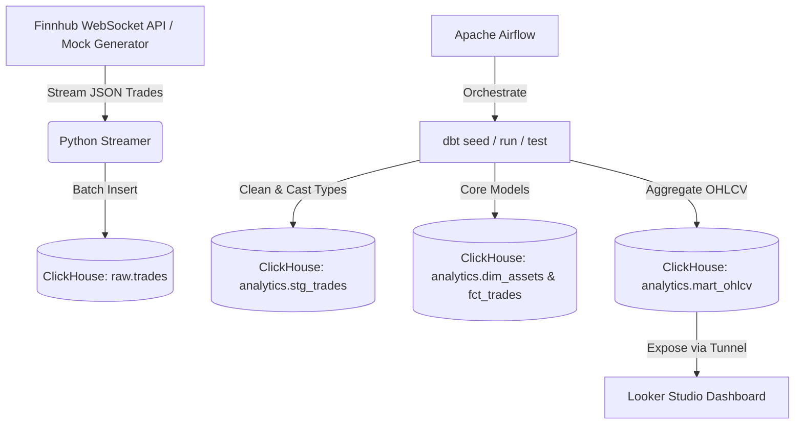

# FinnHub Streaming Data Pipeline (ภาษาไทย)

โปรเจกต์ Data Engineering ท่อส่งข้อมูลธุรกรรมทางการเงิน (หุ้นและคริปโทฯ) จาก **Finnhub WebSocket API** (หรือจำลองข้อมูลด้วย Mock Mode) ส่งเข้าสู่ **ClickHouse**, ทำการแปลงข้อมูล (Transform) ด้วย **dbt**, กำหนดรอบทำงาน (Orchestrate) ด้วย **Apache Airflow** และวิเคราะห์ผลบน **Looker Studio (Google Data Studio)**

---

## สถาปัตยกรรมระบบ (Architecture)



## ฟีเจอร์หลัก (Features)
- **สถาปัตยกรรมแบบ Decoupled (แยกส่วนอิสระ)**: ตัวดึงข้อมูล (Ingestion) และตัวแปลงข้อมูล (dbt) ทำงานแยกจากกันเพื่อความเสถียรและประสิทธิภาพสูงสุดตามคำแนะนำเชิงสถาปัตยกรรม
- **Dual Ingestion Mode**: สามารถดึงข้อมูลตลาดหุ้นจริงผ่าน API Key หรือจำลองการซื้อขายแบบออฟไลน์ด้วย **Mock Trade Generator** เพื่อให้ทดสอบระบบได้ทันทีโดยไม่ต้องระบุคีย์
- **Star Schema Design**: จัดโครงสร้างตารางข้อมูลในระดับ Core Layer ออกเป็นตารางมิติ (Dimension Table: `dim_assets`) และตารางข้อเท็จจริง (Fact Table: `fct_trades`) ตามรูปแบบโมเดลข้อมูลระดับโปรดักชัน
- **Incremental Data Load**: ใช้ Incremental Model ใน dbt เพื่อโหลดเฉพาะข้อมูลใหม่ ช่วยประหยัดทรัพยากรฐานข้อมูลกรณีปริมาณข้อมูลธุรกรรมมีขนาดใหญ่มาก
- **ClickHouse Optimization**: ใช้การเขียนแบบ micro-batches ในโปรแกรมดึงข้อมูลเพื่อลดการทำงานของดิสก์ และใช้ฟังก์ชันเฉพาะของ ClickHouse เช่น `argMin`/`argMax` คำนวณราคาเปิดและปิดอย่างมีประสิทธิภาพสูงสุด

---

## ขั้นตอนการติดตั้งและรันระบบ

### 1. สิ่งที่ต้องมีก่อนติดตั้ง (Prerequisites)
- ติดตั้ง **Docker & Docker Compose**
- (ตัวเลือกเพิ่มเติม) สมัครขอ API key ฟรีจาก [Finnhub.io](https://finnhub.io/)
- (ตัวเลือกเพิ่มเติม) ติดตั้ง [ngrok](https://ngrok.com/) บนเครื่องเพื่อใช้เชื่อมต่อ Looker Studio กับฐานข้อมูลเครื่องตัวเอง

### 2. การสั่งเริ่มทำงาน
จากไดเรกทอรีหลักของโปรเจกต์ สั่งรันด้วยคำสั่ง:

```bash
docker-compose up --build -d
```

หากต้องการใช้ข้อมูลจริง ให้สร้างไฟล์ `.env` ที่โฟลเดอร์หลักก่อนสั่งรัน:
```env
FINNHUB_API_KEY=รหัส_api_key_ของคุณ
```

### 3. ตรวจสอบสถานะการทำงาน
ดูความสมบูรณ์ของ Containers:
```bash
docker-compose ps
```

เข้าสู่ระบบจัดการ workflow (Airflow Web UI):
- **URL**: `http://localhost:8080`
- **Username**: `admin`
- **Password**: `admin`
- เข้าไปที่ DAG `finnhub_dbt_run` เพื่อกดเปิดและสั่งรันคำสั่งดึงข้อมูล/แปลงข้อมูล (dbt)

---

## การสืบค้นข้อมูลใน ClickHouse (ตัวอย่างคิวรี)

ตรวจสอบข้อมูลซื้อขายดิบ (Raw layer) ที่เข้ามาแบบต่อเนื่อง:
```bash
docker exec -it sharp-maxwell-clickhouse-1 clickhouse-client --query "SELECT * FROM raw.trades LIMIT 10"
```

ตรวจสอบตารางสรุปราคารายนาที (Mart layer):
```bash
docker exec -it sharp-maxwell-clickhouse-1 clickhouse-client --query "SELECT * FROM analytics.mart_ohlcv LIMIT 10"
```

---

## การเชื่อมต่อกับ Looker Studio (Google Data Studio)

เนื่องจาก Looker Studio ทำงานอยู่บนคลาวด์ แต่ ClickHouse ของเราทำงานอยู่ใน Docker เครื่องคอมพิวเตอร์ของคุณเอง เราจึงต้องใช้ **ngrok** เพื่อเปิดช่องสัญญาณ:

1. เปิดช่องสัญญาณพอร์ต ClickHouse HTTP (`8123`):
   ```bash
   ngrok http 8123
   ```
2. คัดลอก URL ที่ ngrok ส่งออกให้สาธารณะ (เช่น `https://xxxx-xx-xx.ngrok-free.app`)
3. เข้าสู่เว็บ [Looker Studio](https://lookerstudio.google.com/) แล้วเลือกสร้างแหล่งข้อมูลใหม่ ค้นหา Connector ชื่อ **ClickHouse**
4. ตั้งค่าเพื่อเชื่อมต่อผ่านช่องทางของ ngrok:
   - **Host**: `xxxx-xx-xx.ngrok-free.app` (ไม่ต้องพิมพ์ `https://`)
   - **Port**: `443` (พอร์ตมาตรฐาน HTTPS ของ ngrok)
   - **User**: `default`
   - **Password**: (เว้นว่างไว้)
   - **Database**: `analytics`
   - **Table**: `mart_ohlcv`


---

## ระบบแนะนำการลงทุนอัจฉริยะ (Smart Investment Advisor)

เพื่อตอบโจทย์ผู้ใช้งานที่ **"วิเคราะห์กราฟเทคนิคไม่เก่ง"** และไม่ต้องการเสียเวลาคอยถามแชทบอทเพิ่มเติมว่า **"หากมีงบลงทุนเท่านี้ และต้องการกำไร x% ภายใน 3 เดือน ควรซื้อสินทรัพย์ตัวไหนมากที่สุด?"** 

เราจึงได้พัฒนาโมเดลข้อมูลขึ้นมาใหม่ชื่อ **`mart_investment_advisor`** ซึ่งทำงานร่วมกับฟีเจอร์ Input Parameter ของ Looker Studio ช่วยให้คำนวณและแสดงผลลัพธ์ตอบคำถามนี้ได้โดยตรงบนแดชบอร์ดแบบโต้ตอบได้ (Interactive Dashboard):

### 1. ข้อมูลที่ dbt คำนวณไว้ให้ (Data Fields):
- `current_price`: ราคาตลาดปัจจุบันล่าสุดของสินทรัพย์
- `target_median`: ราคาเป้าหมายเฉลี่ยที่นักวิเคราะห์ Wall Street คาดการณ์ในอีก 1 ปีข้างหน้า
- `upside_potential_percent`: โอกาสเติบโตของราคา (%) ในระยะ 1 ปี
- `estimated_gain_3m_percent`: อัตรากำไรคาดการณ์ในระยะ 3 เดือน (คิดเป็น 25% ของเป้าหมาย 1 ปี)
- `consensus_rating`: คะแนนคำแนะนำจากนักวิเคราะห์ส่วนใหญ่ (เช่น *Strong Buy*, *Buy*, *Hold*, *Sell*) เพื่อใช้คัดกรองความมั่นใจ

### 2. การทำงานบนแดชบอร์ด Looker Studio:
1. **กรอกงบลงทุน (Budget)** และ **เป้าหมายกำไร (Target Profit %)**: ผู้ใช้งานสามารถระบุตัวเลขงบประมาณ (เช่น $10,000) และเป้าหมายกำไรที่ต้องการ (เช่น 10%) ลงในช่องป้อนข้อมูล (Input Control) บนแดชบอร์ดได้ทันที
2. **การคำนวณผลลัพธ์อัตโนมัติบนแดชบอร์ด**: 
   - **จำนวนหุ้นที่จะได้รับ (Shares to Buy)**: คำนวณจากสูตร `Budget / current_price`
   - **กำไรคาดการณ์ภายใน 3 เดือน (Expected Profit)**: คำนวณจากสูตร `Budget * (estimated_gain_3m_percent / 100)`
   - **บรรลุเป้าหมายหรือไม่? (Target Achieved?)**: ใช้สูตรเปรียบเทียบ `IF(estimated_gain_3m_percent >= Target_Profit, '✅ ผ่านเกณฑ์', '❌ ต่ำกว่าเกณฑ์')`
3. **การแสดงผลแนะนำสินทรัพย์ (Recommendation Ranking)**: แดชบอร์ดจะแสดงรายการหุ้นโดยจัดอันดับจากสินทรัพย์ที่มี `estimated_gain_3m_percent` สูงสุดลงมา เพื่อบอกให้ผู้ใช้ทราบทันทีว่า **"ควรซื้อสินทรัพย์ตัวไหนมากที่สุดเพื่อให้ได้รับผลตอบแทนตามงบประมาณและกำไรที่ตั้งไว้"**

---

## แผนการออกแบบสถาปัตยกรรม (Architectural Design)

โปรเจกต์นี้ได้รับการออกแบบตามแนวทางปฏิบัติที่ดีที่สุด (DE Best Practices) เพื่อหลีกเลี่ยงข้อผิดพลาด (Anti-patterns) ต่างๆ:

### 1. แยกส่วนการดึงข้อมูลกับการแปลงข้อมูล (Decoupling)
- **สิ่งที่เราทำ**: ตัวดึงข้อมูล (Ingestion) เป็นสคริปต์ Python ที่รันต่อเนื่องเพื่อบันทึกข้อมูลดิบลงฐานข้อมูล ในขณะที่การรัน dbt แปลงข้อมูลจะสั่งผ่านระบบ Airflow เป็นรอบเวลา (Batch) 
- **ทำไมจึงไม่รัน dbt ต่อท้ายการดึงข้อมูลทันที?**: การเชื่อมคำสั่ง Ingest และ dbt run เข้าด้วยกันในลูปเดียวกันเป็นวิธีที่ไม่แนะนำ (Anti-pattern) หากข้อมูลต้นทางเข้ามาถี่มาก (เช่น ดึงข้อมูลทุกวินาทีหรือทุก 5 นาที) การไปสั่ง `dbt run` ทุกครั้งจะส่งผลให้ระบบฐานข้อมูล ClickHouse ทำงานหนักเกินความจำเป็นจนทำให้ฐานข้อมูลล่ม การแยก Ingest ให้อิสระทำให้เขียนข้อมูลดิบได้รวดเร็ว และคัดแยกการทำ Transformation มาทำงานเป็นระยะตามต้องการแทน

### 2. นำงานสตรีมมิ่งออกนอก Airflow (Streaming Outside Airflow)
- **สิ่งที่เราทำ**: ตัวเขียนสตรีม WebSocket ถูกรันแยกเป็น Docker service ตัวใหม่ (`streamer`) โดยไม่ได้รันอยู่ในขอบเขตของ Airflow
- **ทำไมไม่รันงานสตรีมมิ่งใน Airflow?**: Airflow ถูกออกแบบมาสำหรับจัดการงานที่เป็นรอบๆ (Batch Workflow) ที่มีเวลาเริ่มต้นและสิ้นสุดชัดเจน การนำสคริปต์สตรีมมิ่งที่ต้องรันค้าง 24 ชั่วโมงไปใส่ไว้ใน Airflow Task (เช่น PythonOperator) จะล็อกการทำงานของ Airflow Worker, ทำให้ระบบตรวจสอบสถานะพัง, เปลืองทรัพยากร และสุ่มเสี่ยงทำให้คิวงานอื่นระเบิด

---

## คำตอบคำถามการบ้าน (Homework Answers)

### 1. What did you learn from this project? (ได้เรียนรู้อะไรจากโปรเจกต์นี้?)
- **การจัดการ Real-Time Ingestion**: ได้รู้วิธีเขียน WebSocket Client ใน Python ที่ต่อสู้กับการขาดการเชื่อมต่อ (Auto-reconnection) และสร้างระบบพักข้อมูล (Buffer/Queue) ในหน่วยความจำเพื่อนำไปบันทึกเป็นชุด (Micro-batches) ลง ClickHouse เพื่อป้องกันปัญหาเรื่องความถี่ในการเขียนฮาร์ดดิสก์
- **สถาปัตยกรรม Data Modeling (Star Schema & Medallion)**: ได้เรียนรู้การจัดชั้นเก็บข้อมูลจากตาราง OBT มาทำการแยกเป็นตารางมิติ (Dimension Table: `dim_assets`) และตารางบันทึกการซื้อขายจริง (Fact Table: `fct_trades`) ซึ่งทำให้ระบุและวิเคราะห์ตามหมวดสินทรัพย์ได้ง่ายและเป็นระเบียบขึ้น
- **การใช้งาน dbt ร่วมกับ ClickHouse**: ได้รู้วิธีใช้ Adapter `dbt-clickhouse` เพื่อรันคำสั่ง SQL ที่ใช้ฟังก์ชันความเร็วสูง เช่น `argMin`/`argMax` ในการหาจุดราคาเปิด/ปิดของสินทรัพย์รายนาทีได้อย่างมีประสิทธิภาพ

### 2. How would you improve it? (หากปรับปรุงระบบนี้ต่อได้ จะทำอะไรบ้าง?)
- **เพิ่ม Message Broker (Kafka/Redpanda)**: ปัจจุบันตัวดึงข้อมูล WebSocket เขียนตรงเข้า ClickHouse หากฐานข้อมูลรีสตาร์ทข้อมูลอาจหาย ควรนำ Kafka มาขวางกลางเพื่อเป็นบัฟเฟอร์เก็บข้อมูลงวดแรกก่อน
- **ออกแบบ Incremental Model ทั้งหมด**: ปรับปรุงคำสั่งของ dbt ในส่วนตารางมาร์ทให้ประมวลผลเพิ่มขึ้นแบบ Incremental โดยสมบูรณ์เพื่อประหยัด CPU เมื่อระบบขยายขนาดขึ้น
- **ติดตั้ง Data Contract และ Schema Registry**: ป้องกันกรณีที่ APIs ของ Finnhub ปรับเปลี่ยนโครงสร้างข้อมูลจนทำให้ท่อส่งปลายทางพัง

### 3. If you have to do it all over again, what would you do it differently? (ถ้าเริ่มใหม่หมดได้ จะเปลี่ยนวิธีทำอย่างไร?)
- **เปลี่ยนไปใช้ ClickHouse Materialized Views**: แทนที่จะใช้ Airflow มารันคำสั่งแปลงข้อมูลเป็นรอบ (Batch) จะเปลี่ยนไปใช้งานฟีเจอร์ Materialized Views ของ ClickHouse เพื่อให้เมื่อข้อมูลดิบเขียนเข้าฐานข้อมูล จะถูกรวมผลสรุป OHLCV ทันทีแบบ Real-time โดยสิ้นเชิง
- **ใช้ Data Agent สำเร็จรูปแทนการเขียนสคริปต์เอง**: เปลี่ยนไปใช้ซอฟต์แวร์เก็บข้อมูลที่มีความเสถียรและประหยัดโค้ด เช่น **Vector** หรือ **Benthos** เพื่อดึงข้อมูลจาก WebSocket ตรงลง ClickHouse แทนการดีบักสคริปต์ Python เอง
